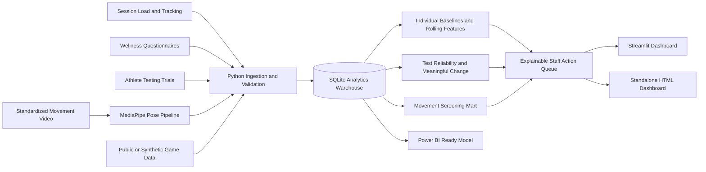

# 🏀 Pacers Performance IQ

### Integrated Athlete Readiness, Testing, Movement and Basketball Performance Intelligence Platform

[](https://www.python.org/)
[](https://www.sqlite.org/)
[](https://www.r-project.org/)
[](https://streamlit.io/)
[](https://developers.google.com/mediapipe)
[](LICENSE)

**Pacers Performance IQ** is an end-to-end basketball sports-performance intelligence platform designed to support daily athlete monitoring, physical testing, movement assessment, game-performance analysis and communication between sports-performance staff.

The platform combines:

* Athlete workload data
* Wellness and readiness questionnaires
* Countermovement jump testing
* Sprint and change-of-direction testing
* Strength testing
* Markerless movement analysis
* Basketball game-performance data
* SQL data engineering
* Python and R analytics
* Interactive dashboards

> **Disclaimer:** This is an unofficial portfolio project created by **Ritik Nehra**. It is not affiliated with the Indiana Pacers, Pacers Sports & Entertainment or the NBA. All athlete-monitoring, testing, wellness and movement data in this repository are synthetic and de-identified.

---

## 📌 Project Objective

The platform is designed to answer one important daily question:

> **Which athletes need attention today, what changed, how confident are we in the signal and what should the performance staff examine next?**

The system provides decision support for sports-performance professionals.

It does **not** provide:

* Medical diagnoses
* Injury predictions
* Return-to-play clearance
* Participation decisions
* Automated medical recommendations

---

## 🚀 Why This Project Is Different

Most public basketball analytics projects focus on:

* Shot charts
* Player rankings
* Team comparisons
* Game predictions
* Box-score analysis

Pacers Performance IQ models the broader responsibilities of a professional sports-performance intelligence department.

The platform:

* Integrates workload, wellness, athlete testing, biomechanics and game data.
* Compares athletes with their own recent baselines.
* Evaluates whether testing changes exceed normal measurement noise.
* Produces an explainable performance-staff action queue.
* Displays confidence and data-quality indicators.
* Connects pregame readiness with game performance without claiming causation.
* Tracks data quality, privacy classification and analytical limitations.

---

## 🎯 Skills Demonstrated

| Skill Area                           | Project Evidence                                                                                                                     |
| ------------------------------------ | ------------------------------------------------------------------------------------------------------------------------------------ |
| Sports performance analytics         | Individual athlete baselines, readiness monitoring, internal and external load, rolling exposure trends and game-performance context |
| Athlete testing and evaluation       | CMJ, 10-meter sprint, 505 change of direction, IMTP-style testing, trial CV, typical error and meaningful-change signals             |
| Biomechanics and movement assessment | MediaPipe and OpenCV video analysis, joint-angle extraction, landing asymmetry, trunk lean and pose-confidence filtering             |
| Data visualization                   | Interactive Streamlit dashboard and standalone HTML executive dashboard                                                              |
| SQL                                  | Indexed SQLite warehouse, fact tables, analytical marts, reusable views and data-quality queries                                     |
| Python                               | ETL, synthetic data generation, feature engineering, statistics, computer vision, visualization and automated testing                |
| R                                    | ICC, CV, SEM, typical error and reliability visualizations                                                                           |
| Communication                        | Explainable staff notes, reason codes, confidence labels, action queues and limitations                                              |
| Data governance                      | Synthetic data classification, data-quality auditing, privacy notes and responsible-use documentation                                |

---

## 🏗️ System Architecture



---

# 📊 Core Analytics Modules

## 1. Individualized Athlete Readiness Monitoring

The system evaluates every athlete relative to their own previous observations rather than applying one universal threshold to the entire roster.

For each athlete, the pipeline calculates leakage-safe robust z-scores using the previous 28 observations.

The current observation is excluded from its own baseline.

### Readiness inputs

* Sleep duration
* Fatigue score
* Muscle soreness
* External workload
* Countermovement jump height
* Reactive Strength Index Modified
* Seven-day workload
* Twenty-eight-day workload
* Testing recency
* Data completeness

### Readiness classifications

Each athlete is classified as:

* **Normal**
* **Monitor**
* **Discuss**
* **Building Baseline**

The first ten observations are labeled **Building Baseline** rather than producing an unreliable readiness score.

### Explainable output

Each result includes:

* Athlete readiness score
* Primary contributing factor
* Supporting values
* Baseline comparison
* Testing recency
* Data-confidence level
* Suggested staff-review note

---

## 2. Athlete Testing and Evaluation

The testing module includes repeated trials for several common performance assessments.

### Countermovement Jump

Metrics include:

* Jump height
* RSI-mod
* Peak power per kilogram
* Countermovement depth
* Peak braking force per kilogram

### Sprint Testing

* 10-meter sprint time

### Change-of-Direction Testing

* 505 left-side time
* 505 right-side time
* Inter-limb difference

### Strength Testing

* Isometric mid-thigh pull-style peak force per kilogram

### Reliability and change analysis

The analytical layer calculates:

* Session mean
* Standard deviation
* Coefficient of variation
* Recent 28-day average
* Between-session variation
* Typical-error estimate
* Standard error of measurement
* Smallest worthwhile change
* Number of baseline observations

A result is classified as:

* **Improved**
* **Stable**
* **Declined**
* **Building Baseline**

A change is only highlighted when it exceeds the larger measurement-aware threshold.

---

## 3. Biomechanics and Movement Assessment

The optional computer-vision module uses MediaPipe and OpenCV to process standardized athlete movement videos.

The module can be used with movements such as:

* Drop jumps
* Squats
* Landing assessments
* Change-of-direction drills
* Single-leg movements

### Extracted features

* Left knee angle
* Right knee angle
* Left hip angle
* Right hip angle
* Trunk lean
* Knee-separation ratio
* Inter-limb knee-angle asymmetry
* Pose-detection confidence
* Frame-level movement data

### Generated outputs

* Annotated MP4 video
* Frame-level CSV file
* Trial-level JSON summary
* Representative movement frame
* Movement-screening score
* Pose-confidence summary

> The movement module is intended for screening and technical demonstration only. It is not a clinical diagnostic system.

Camera angle, lighting, occlusion, frame rate and capture protocol can significantly affect markerless movement measurements.

---

## 4. Basketball Game-Performance Bridge

The project connects pregame readiness information with synthetic game-performance data.

Example game variables include:

* Minutes played
* Usage rate
* Effective field-goal percentage
* Points per 36 minutes
* Assists per 36 minutes
* Rebounds per 36 minutes
* Turnovers
* Composite game-performance index

The dashboard displays descriptive relationships between readiness and game performance.

These relationships are not treated as causal because other factors may include:

* Opponent quality
* Player role
* Tactical decisions
* Score state
* Rotation changes
* Travel
* Schedule density
* Game context

---

## 5. Data Quality and Governance

The platform tracks data quality across all source and analytical tables.

### Data-quality checks

* Primary-key completeness
* Duplicate records
* Missing-value percentage
* Invalid ranges
* Source-table row counts
* Analytical-table row counts
* Column counts
* Data-source labels
* Synthetic-data classification
* Staff-facing confidence status

### Responsible-use principles

* No real athlete medical data
* No injury prediction
* No medical diagnosis
* No automated return-to-play recommendation
* No universal athlete cutoff
* No causal claims from descriptive associations
* Transparent scoring logic
* Visible data-quality limitations

---

# 🗄️ SQL Warehouse

The project uses a star-style SQLite analytical warehouse.

## Dimension Tables

```text
dim_athlete
dim_game
```

## Source Fact Tables

```text
fact_session
fact_wellness
fact_test_trial
fact_movement_trial
fact_game_performance
```

## Analytical Marts

```text
mart_daily_status
mart_team_daily
mart_test_session
mart_test_reliability
mart_test_change
mart_movement_session
mart_game_readiness
audit_data_quality
```

## Operational Views

```text
vw_latest_team_status
vw_staff_action_queue
vw_latest_test_signals
vw_latest_movement
vw_game_performance_bridge
```

Interview-ready SQL examples are available in:

```text
sql/03_analysis_queries.sql
```

---

# 📁 Repository Structure

```text
pacers-performance-intelligence/
│
├── dashboard/
│   └── app.py
│
├── data/
│   ├── raw/
│   └── processed/
│
├── docs/
│   ├── PROJECT_OVERVIEW.md
│   ├── VALIDATION_AND_ETHICS.md
│   ├── POWER_BI_GUIDE.md
│   └── INTERVIEW_GUIDE.md
│
├── models/
│   └── README.md
│
├── outputs/
│   ├── pacers_performance_iq_demo.html
│   └── latest_staff_action_queue.csv
│
├── r/
│   └── test_reliability.R
│
├── sql/
│   ├── 01_schema.sql
│   ├── 02_views.sql
│   └── 03_analysis_queries.sql
│
├── src/
│   ├── generate_demo_data.py
│   ├── feature_engineering.py
│   ├── build_warehouse.py
│   ├── export_static_dashboard.py
│   ├── run_pipeline.py
│   │
│   └── biomechanics/
│       └── pose_assessment.py
│
├── tests/
│   ├── test_features.py
│   ├── test_pipeline.py
│   └── test_data_quality.py
│
├── requirements.txt
├── requirements-biomechanics.txt
├── LICENSE
└── README.md
```

---

# ⚙️ Installation

## 1. Clone the repository

```bash
git clone https://github.com/Ritik7nehra/pacers-performance-intelligence.git
cd pacers-performance-intelligence
```

## 2. Create a virtual environment

### Windows

```bash
python -m venv venv
venv\Scripts\activate
```

### macOS or Linux

```bash
python -m venv venv
source venv/bin/activate
```

## 3. Install dependencies

```bash
python -m pip install --upgrade pip
python -m pip install -r requirements.txt
```

---

# ▶️ Running the Complete Pipeline

```bash
python -m src.run_pipeline
```

This command:

1. Generates a deterministic synthetic basketball season.
2. Creates athlete workload and wellness data.
3. Generates repeated athlete-testing trials.
4. Creates synthetic movement-screening data.
5. Generates player-game performance data.
6. Builds individualized athlete baselines.
7. Calculates testing reliability and meaningful-change signals.
8. Builds the SQLite analytical warehouse.
9. Creates staff-facing SQL views.
10. Exports the standalone HTML dashboard.
11. Exports the latest staff action queue.

---

# 📱 Running the Streamlit Dashboard

```bash
streamlit run dashboard/app.py
```

The application includes the following pages:

* Morning Board
* Athlete 360
* Testing Lab
* Movement Assessment
* Performance Bridge
* Data Quality

---

# 🌐 Opening the Standalone Dashboard

Open the following file in a web browser:

```text
outputs/pacers_performance_iq_demo.html
```

The dashboard is self-contained and does not require a running server.

---

# 🧪 Running Automated Tests

```bash
python -m pytest
```

The automated tests validate:

* Individual baseline calculations
* Leakage prevention
* Readiness-score ranges
* Test-change classification
* Data-quality checks
* Warehouse creation
* SQL-view creation
* Pipeline outputs

---

# 📈 Running the R Reliability Analysis

The R workflow calculates:

* ICC(2,1)
* Standard error of measurement
* Typical error
* Coefficient of variation
* Athlete-level reliability
* Smallest worthwhile change

Run:

```bash
Rscript r/test_reliability.R \
  data/raw/testing_long.csv \
  outputs/r_reliability \
  jump_height_cm \
  CMJ
```

---

# 🎥 Running Movement-Video Analysis

## 1. Install optional biomechanics dependencies

```bash
python -m pip install -r requirements-biomechanics.txt
```

## 2. Add a compatible MediaPipe model

Follow the instructions in:

```text
models/README.md
```

## 3. Run the assessment

```bash
python -m src.biomechanics.pose_assessment \
  --video data/raw/drop_jump.mp4 \
  --model models/pose_landmarker_full.task \
  --athlete-id P01 \
  --date 2026-04-15
```

---

# 📋 Example Staff Action Queue

| Athlete | Status            | Primary Factor            | Data Confidence | Suggested Review                                     |
| ------- | ----------------- | ------------------------- | --------------- | ---------------------------------------------------- |
| P03     | Discuss           | Elevated soreness         | High            | Review wellness response and recent workload         |
| P08     | Monitor           | CMJ below baseline        | Medium          | Confirm testing quality and review recent jump trend |
| P11     | Monitor           | Elevated seven-day load   | High            | Discuss recent exposure and planned training         |
| P05     | Normal            | No major deviations       | High            | Continue normal monitoring                           |
| P14     | Building Baseline | Insufficient observations | Low             | Continue data collection                             |

---

# 🖥️ Dashboard Pages

## Morning Board

Provides a team-level view of:

* Athlete readiness
* Status classification
* Main contributing factor
* Data confidence
* Staff-review notes
* Team readiness distribution

## Athlete 360

Displays:

* Individual readiness trend
* Workload history
* Wellness responses
* CMJ results
* Personal baseline comparisons
* Recent game-performance context

## Testing Lab

Displays:

* Testing-session results
* Trial variability
* Meaningful-change classification
* Reliability statistics
* Athlete-specific testing trends

## Movement Assessment

Displays:

* Knee-angle trends
* Hip-angle trends
* Trunk lean
* Asymmetry values
* Pose confidence
* Movement-screening summaries

## Performance Bridge

Displays:

* Pregame readiness
* Minutes
* Usage
* Effective field-goal percentage
* Per-36 performance
* Descriptive readiness-performance relationships

## Data Quality

Displays:

* Missingness
* Duplicate records
* Table row counts
* Validation status
* Source classification
* Analytical confidence

---

# 💼 Resume Description

## Pacers Performance IQ — Sports Performance Intelligence Platform

**Python, SQL, R, Streamlit, MediaPipe, OpenCV, Plotly and SQLite**

* Engineered an end-to-end basketball performance intelligence platform integrating more than **21,000 synthetic records** across workload, wellness, repeated athlete testing, movement screening and player-game performance.
* Developed individualized 28-day athlete baselines using robust z-scores, test-recency confidence and explainable readiness reason codes.
* Created measurement-aware CMJ change detection using trial coefficient of variation, typical error and smallest-worthwhile-change logic.
* Built a MediaPipe and OpenCV markerless movement-analysis pipeline that extracts lower-extremity joint angles, trunk lean, landing asymmetry and pose confidence.
* Designed an indexed SQLite warehouse with analytical marts, reusable SQL views, staff action queues and automated data-quality checks.
* Delivered insights through a Streamlit application, standalone HTML dashboard, Power BI-ready model and R reliability workflow.

---

# 🗣️ Interview Explanation

> I developed Pacers Performance IQ as a production-shaped sports-performance analytics project. It integrates daily athlete workload, wellness questionnaires, repeated physical testing, movement-video features and basketball game data into a SQL warehouse. Python creates individualized athlete baselines and an explainable morning staff queue, R evaluates test reliability, MediaPipe extracts movement features and Streamlit communicates the results through staff-focused dashboards. I intentionally avoided injury prediction and designed the platform to support rather than replace the judgment of sports-performance and medical professionals.

---

# 🎬 Suggested Live Demonstration

1. Open the **Morning Board**.
2. Identify an athlete classified as **Discuss** or **Monitor**.
3. Open the athlete’s **Athlete 360** profile.
4. Explain the athlete-specific baseline and primary contributing factor.
5. Open the **Testing Lab**.
6. Show whether the athlete’s testing change exceeds measurement noise.
7. Open the **Movement Assessment** page.
8. Explain pose confidence and camera-protocol limitations.
9. Show the SQL view behind the action queue.
10. Finish with the **Data Quality** page.

This demonstration highlights:

* Sports-science reasoning
* Statistical analysis
* SQL and data engineering
* Python development
* Biomechanics
* Dashboard design
* Communication
* Responsible analytics

---

# ⚠️ Important Limitations

* No real Indiana Pacers athlete data are used.
* No medical, health, practice or tracking data from a professional team are included.
* The scoring weights and thresholds are demonstration choices.
* Operational thresholds would require stakeholder calibration.
* The system requires prospective validation before real-world use.
* Synthetic game outcomes cannot support real basketball conclusions.
* Markerless two-dimensional measurements depend on camera setup and visibility.
* Asymmetry is descriptive and must be interpreted carefully.
* Readiness and game-performance associations are not evidence of causation.
* A real deployment would require secure storage, role-based access, privacy review, audit logging and approved retention policies.

---

# 🔮 Future Improvements

* Integrate live wearable-device data.
* Add force-plate API ingestion.
* Support player-tracking coordinates.
* Add automated PDF athlete reports.
* Implement PostgreSQL or Snowflake deployment.
* Add Docker-based deployment.
* Add MLflow experiment tracking.
* Add role-based dashboard authentication.
* Add Bayesian athlete-baseline models.
* Add hierarchical team and position-group models.
* Add longitudinal workload forecasting.
* Validate markerless movement results against motion-capture systems.
* Develop a Power BI production dashboard.
* Add automated data-drift monitoring.

---

# 👨‍💻 Author

## Ritik Nehra

MS Computer Science
Indiana University Indianapolis

* GitHub: [github.com/Ritik7nehra](https://github.com/Ritik7nehra)
* Focus areas: Machine Learning, Data Analytics, Computer Vision, Sports Analytics and Data Engineering

---

# 📄 License

This project is available under the MIT License.

See the `LICENSE` file for details.

---

# ⭐ Acknowledgment

This project was created as a portfolio demonstration for sports-performance intelligence, basketball analytics and data-analytics opportunities.

It is not affiliated with or endorsed by the Indiana Pacers, Pacers Sports & Entertainment or the NBA.
